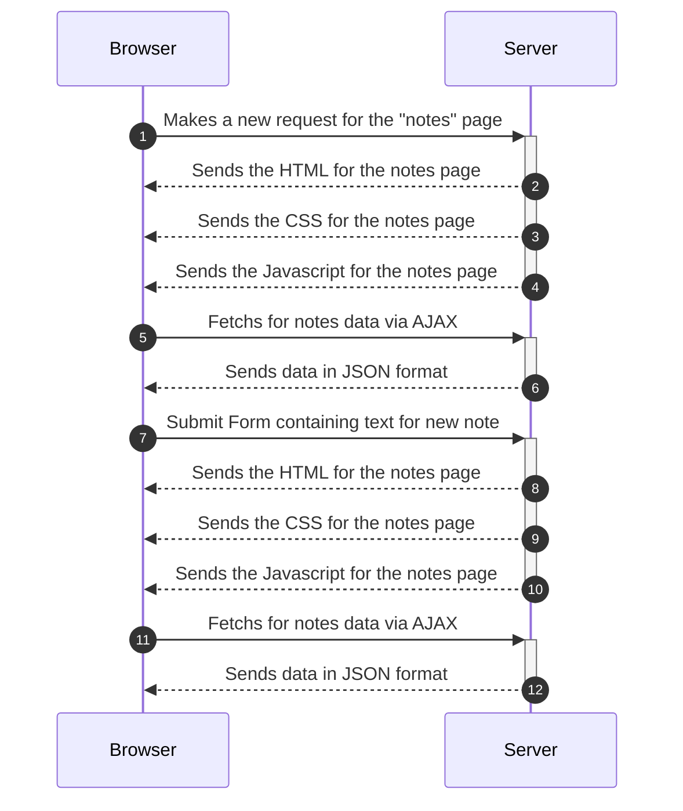

```mermaid
sequenceDiagram
    participant Browser
    participant Server

    autonumber
    Browser->>+Server: Makes a new request for the "notes" page
    Server-->>Browser: Sends the HTML for the notes page
    %%Renders the page with HTML received from server
    Server-->>Browser: Sends the CSS for the notes page
    Server-->>-Browser: Sends the Javascript for the notes page
    Browser->>+Server: Fetchs for notes data via AJAX
    Server-->>-Browser: Sends data in JSON format
    %%The browser executes the callback to render the data fetched from Server
    Browser->>+Server: Submit Form containing text for new note
    Server-->>Browser: Sends the HTML for the notes page
    %%Renders the page with HTML received from server
    Server-->>Browser: Sends the CSS for the notes page
    Server-->>-Browser: Sends the Javascript for the notes page
    Browser->>+Server: Fetchs for notes data via AJAX
    Server-->>-Browser: Sends data in JSON format
    %%The browser executes the callback to render the data fetched from Server
```
