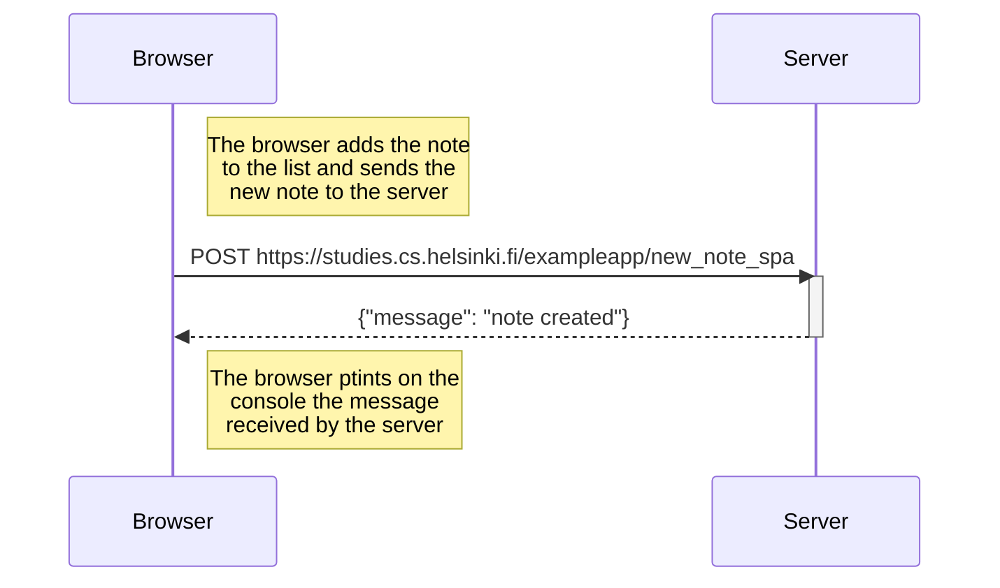

```mermaid
sequenceDiagram
    participant Browser
    participant Server

    Note right of Browser: The browser adds the note<br />to the list and sends the<br /> new note to the server

    Browser->>Server: POST https://studies.cs.helsinki.fi/exampleapp/new_note_spa
    activate Server
    Server-->>Browser: {"message": "note created"}
    deactivate Server

    Note right of Browser: The browser ptints on the<br /> console the message<br />received by the server

```
