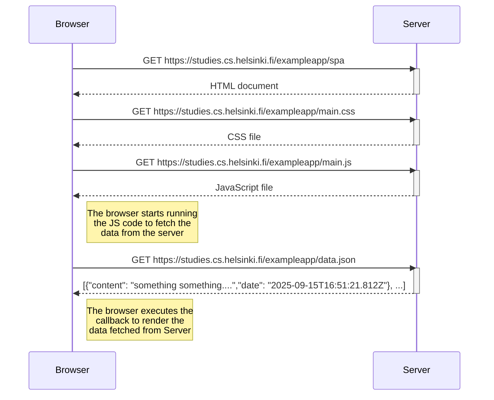

```mermaid
sequenceDiagram
    participant Browser
    participant Server

    Browser->>Server: GET https://studies.cs.helsinki.fi/exampleapp/spa
    activate Server
    Server-->>Browser: HTML document
    deactivate Server

    Browser->>Server: GET https://studies.cs.helsinki.fi/exampleapp/main.css
    activate Server
    Server-->>Browser: CSS file
    deactivate Server

    Browser->>Server: GET https://studies.cs.helsinki.fi/exampleapp/main.js
    activate Server
    Server-->>Browser: JavaScript file
    deactivate Server

    Note right of Browser: The browser starts running<br /> the JS code to fetch the<br />data from the server


    Browser->>Server: GET https://studies.cs.helsinki.fi/exampleapp/data.json
    activate Server
    Server-->>Browser: [{"content": "something something....","date": "2025-09-15T16:51:21.812Z"}, ...]
    deactivate Server

    Note right of Browser: The browser executes the<br />callback to render the<br />data fetched from Server
```
